# 🎓 SmartA - Ứng Dụng Luyện Thi Tổ Hợp Khối A00

**SmartA** là ứng dụng di động hỗ trợ ôn luyện thi THPT Quốc Gia khối A00 (Toán, Lý, Hóa). Ứng dụng tích hợp **Phú Nam AI** (sử dụng Groq API) giúp giải thích chi tiết các câu hỏi khó và hỗ trợ học sinh 24/7.

Đồ án thực hiện bởi: **Nguyễn Phương Nam** & **Nguyễn Dương Bảo Phú** - Đại học Nha Trang (NTU).

---

## 📱 Khám Phá Giao Diện

### 1. Luồng Luyện Thi
| Trang Chủ | Danh Mục Môn | Chọn Chủ Đề | Chọn Đề Thi |
|:---:|:---:|:---:|:---:|
| 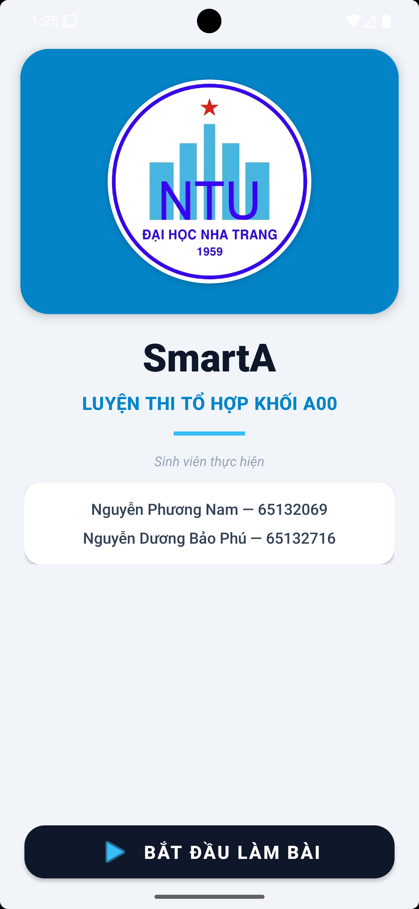 | 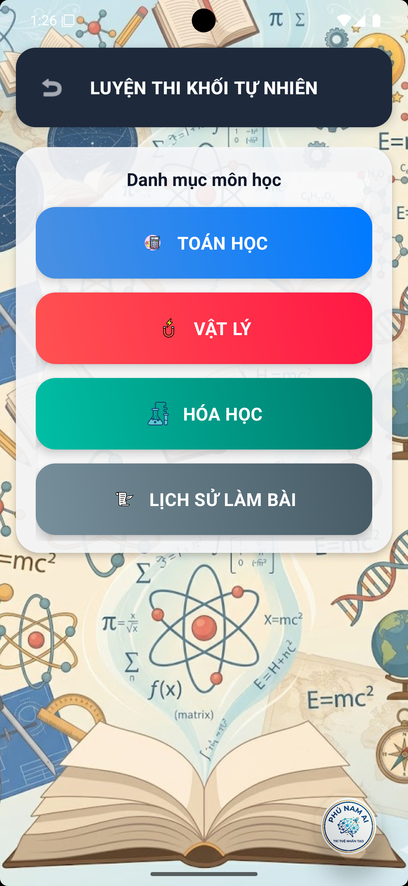 | 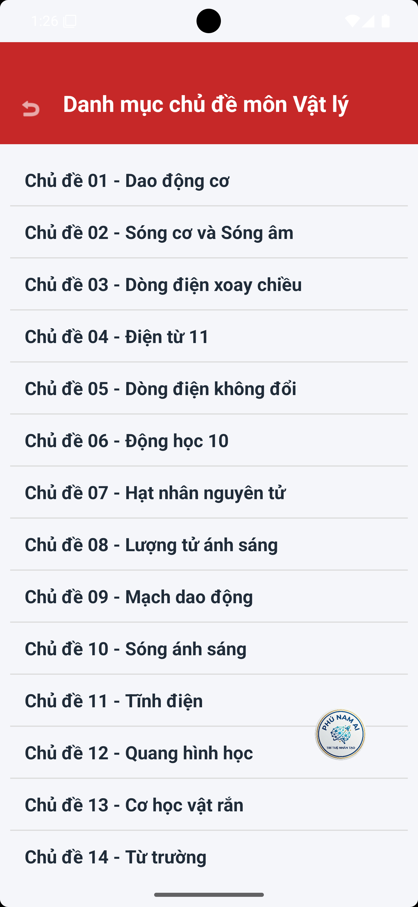 | 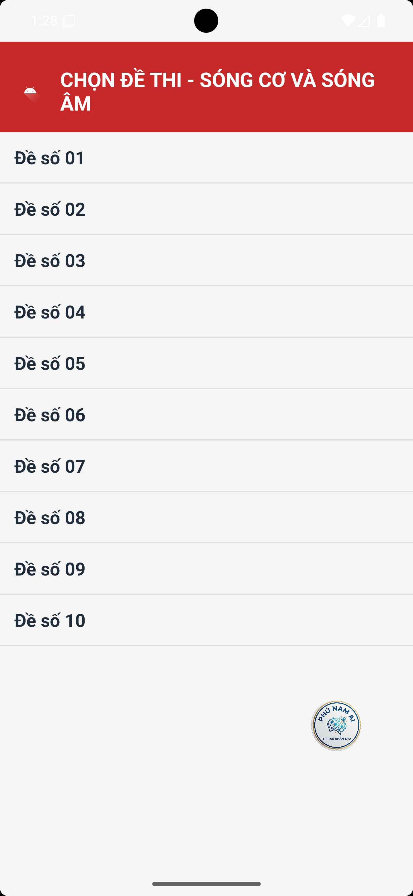 |

### 2. Trải Nghiệm Thi & Kết Quả
| Làm Bài | Lưới Chọn Câu | Xác Nhận Nộp | Kết Quả |
|:---:|:---:|:---:|:---:|
| 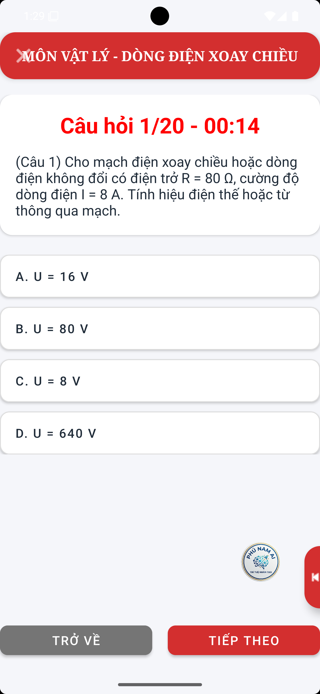 | 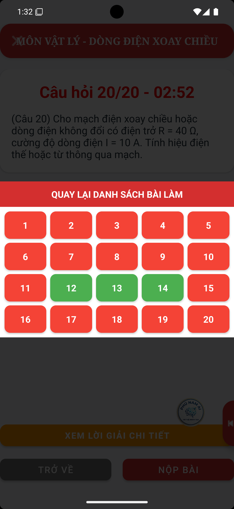 | 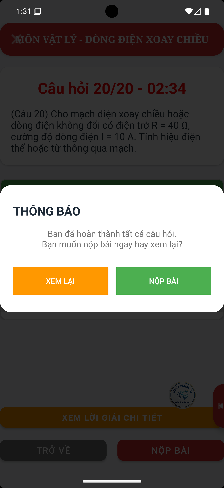 | 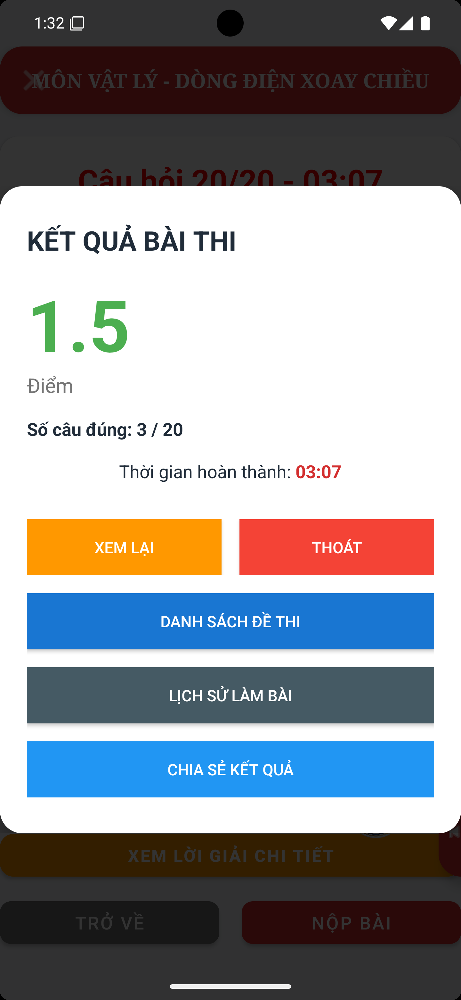 |

### 3. Lịch Sử & Tính Năng AI
| Lịch Sử Thi | Chi Tiết Đúng/Sai | AI Giải Thích | Phú Nam AI | Chat Tự Do |
|:---:|:---:|:---:|:---:|:---:|
| 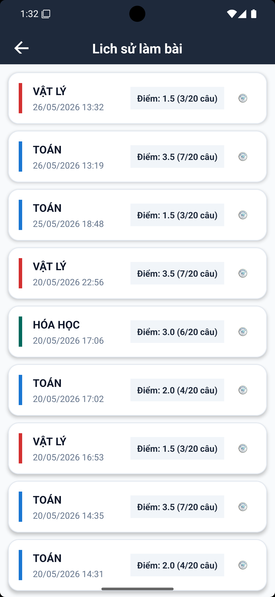 | 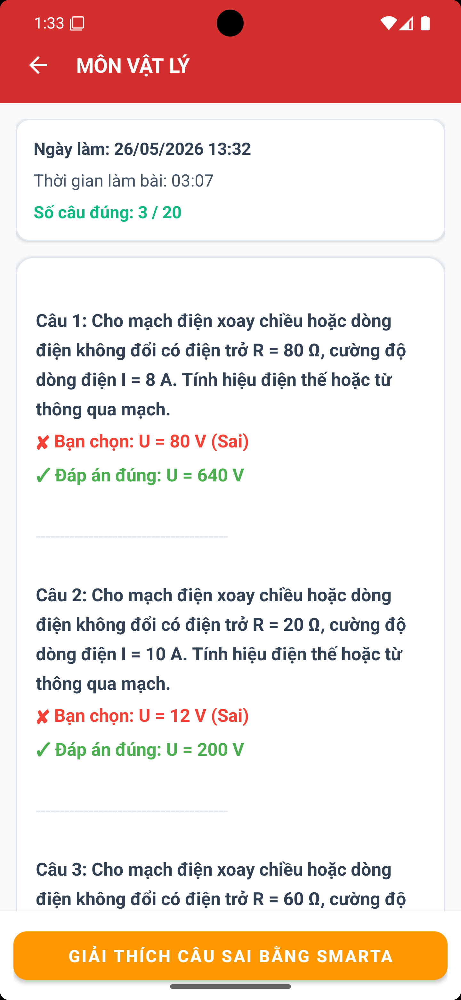 | 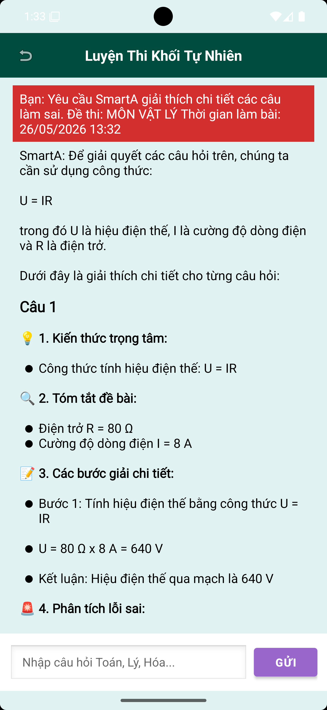 | 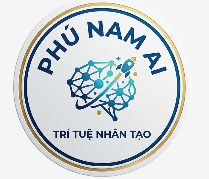 | 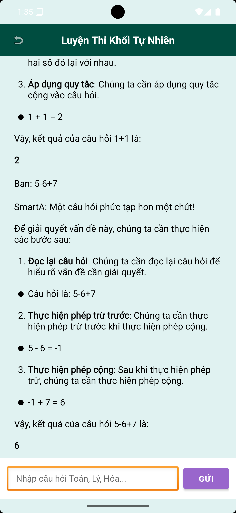 |

---

## ⚙️ Quản Trị Hệ Thống
| Firebase Database | Cấu hình Groq API |
|:---:|:---:|
| 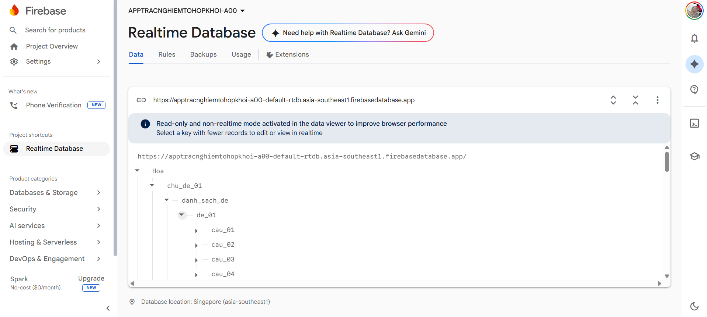 | 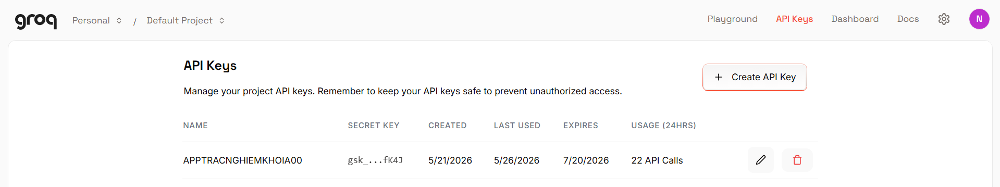 |

---
## 🛠️ Công Nghệ
- **Ngôn ngữ:** Java | **Platform:** Android
- **Backend:** Firebase Realtime Database
- **AI:** Groq Cloud API
